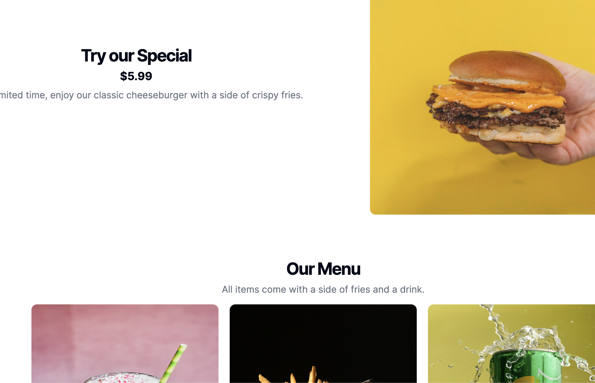

# Fast Food Website

Welcome to the Fast Food Website project! This project aims to provide a seamless experience for users to browse and order delicious fast food items online.

## Getting Started

To get started with the project, follow these steps:

1. Clone the repository to your local machine.
2. Install the necessary dependencies by running:
   ```bash
   npm install
   # or
   yarn install
   # or
   pnpm install
   # or
   bun install
   ```
3. Start the development server by running:
   ```bash
   npm run dev
   # or
   yarn dev
   # or
   pnpm dev
   # or
   bun dev
   ```
4. Open [http://localhost:3000](http://localhost:3000) in your browser to view the website.

## Features

- Browse a wide selection of fast food items.
- Add items to your cart and place orders.
- Customize your orders based on preferences.
- Seamless checkout process.

## Technologies Used

This project utilizes the following technologies:

- Frontend: HTML, CSS, JavaScript
- Backend: Node.js, Express

## Contributing

We welcome contributions to enhance the Fast Food Website project. Feel free to fork the repository and submit pull requests.

## Deployment

The Fast Food Website can be easily deployed using platforms like Heroku or Netlify. Refer to their documentation for deployment instructions.

Thank you for visiting the Fast Food Website project! Enjoy your online fast food ordering experience. 
